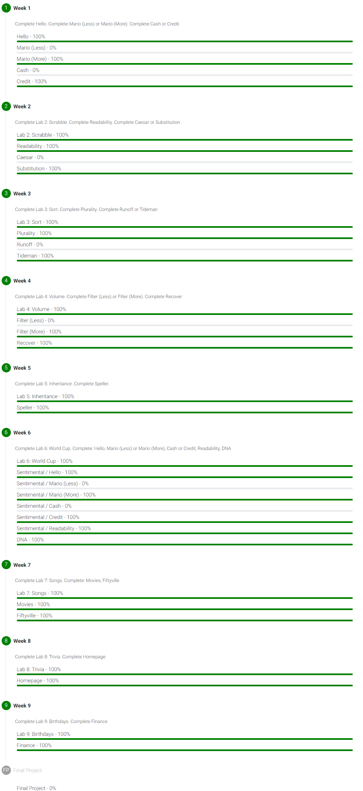

# Summary

[Course station](https://cs50.harvard.edu/x/2022/)

[CS50P](https://github.com/lng205/CS50P)

This is a course for CS beginners. I've completed several embedded projects with C before the course, also I've been learning python through half of [this blog](https://www.liaoxuefeng.com/wiki/1016959663602400).

Thinking as a review, the course surprised me. The C part greatly deepened my understanding of the language. Moreover, the Web application part opened a new world for me. Recommended.

The course took me three weeks in total. Apart from the relaxing time, it's about a hundred hours.

Choose [Nand2Tetris](https://github.com/lng205/Nand2Tetris) as my next course. With complete and open-sourced material, the course has been dubbed 'CS101'. The textbook had just been republished in 2021. The course only requires commanding a high-level language for the latter half, and CS50x is sufficient.

## Week 0

Though scratch is the starting point of the course, skipping it won't affect further study much. Thus students with programming basics could skip this part.

## [Week1](./Week1/readme_en.md)

## [Week2](./Week2/readme_en.md)

## [Week3](./Week3/readme_en.md)

## [Week4](./Week4/readme_en.md)

## [Week5](./Week5/readme_en.md)

## [Week6](./Week6/readme_en.md)

## [Week7](./Week7/readme_en.md)

## [Week8](./Week8/readme_en.md)

## [Week9](./Week9/readme_en.md)

## Week 10

Plan to build a tools station.

Familiar with Linux after the course, I tried to use WSL and Docker, but was not satisfied. So I turned to my [Raspberri pi 4B](https://github.com/lng205/Raspi-WebApp) on hand.

## Gradebook

